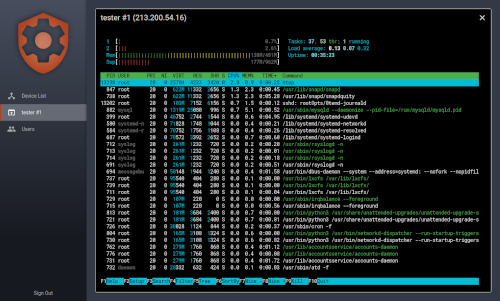

# Remote Configurator

This is a React/Redux/Relay/Next.js app with a Node/Express backend which allows the user to create an in-browser terminal window to any device capable of running a Reverse SSH session no matter whether it is behind NAT and does not have a public IP address or not.

Simply registering the device on the page makes it possible to configure it remotely using the console or to open a securely proxied HTTP connection to any port of the device (Webmin, etc.).




## Installation

NOTE: This project makes use of yarn's "resolutions" feature, so using npm instead of yarn might not be possible

### Sources

```
git clone https://github.com/basarevych/remote-configurator
cp .env.example .env
```

Edit **.env** file and set your options

### Production

```
yarn install --prod
yarn start
```

### Development

```
yarn install
yarn schema
yarn relay
yarn build
```
